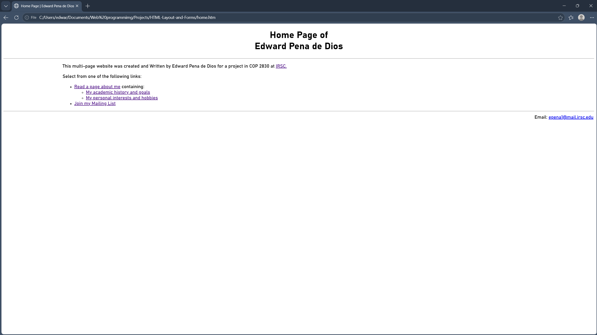
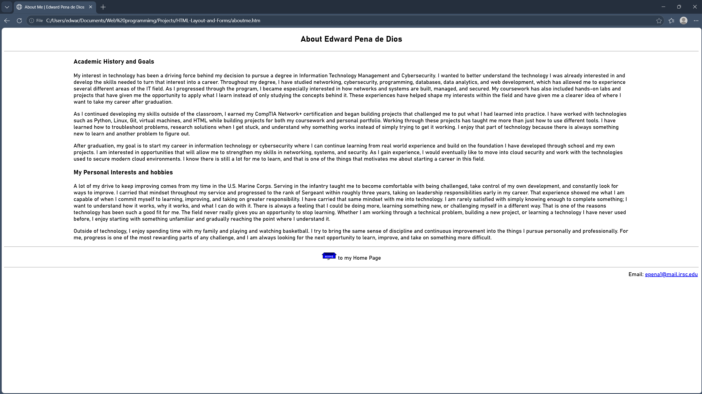
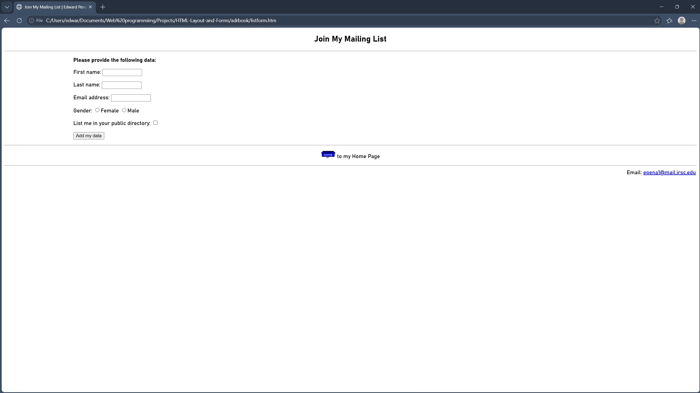

# HTML-Layout-and-Forms

A multi-page HTML5 website demonstrating page structure, navigation, relative links, internal page anchors, and HTML forms. This project was developed to practice organizing multiple webpages across different directories while maintaining functional navigation between them.

## Project Overview

The website consists of three interconnected pages:

- **Home Page** – Provides the main navigation and links to different sections of the website.
- **About Me** – Presents my academic background, technical skills, professional experience, and personal interests.
- **Mailing List** – Demonstrates an HTML form that collects user information using text fields, radio buttons, a checkbox, and a submit button.

## Skills Demonstrated

- HTML5 page structure
- Multi-page website organization
- Relative file paths and navigation
- Internal page anchors
- HTML forms and input elements
- GET form submission
- Semantic HTML elements
- Basic CSS styling
- Hyperlinks and `mailto:` links
- Working with parent and child directories

## Project Structure

    HTML-Layout-and-Forms/
    ├── adrbook/
    │   └── listform.htm
    ├── aboutme.htm
    ├── home.htm
    └── README.md

## Technologies Used

- HTML5
- CSS
- Visual Studio Code
- Git
- GitHub

## Screenshots

### Home Page

The home page provides navigation to the About Me page, specific sections using internal links, and the mailing list form.

### About Me

The About Me page presents my academic background, technical experience, career goals, and personal interests.

### Mailing List Form

The mailing list page demonstrates HTML form elements including text fields, radio buttons, a checkbox, and form submission.

## What I Learned

This project helped me better understand how webpages interact within a multi-page website. I practiced using relative paths to navigate between files stored in different directories, creating links to specific sections of a page, and building HTML forms that send user input to a server-side endpoint. I also gained more experience organizing website files and maintaining consistent navigation across multiple pages.